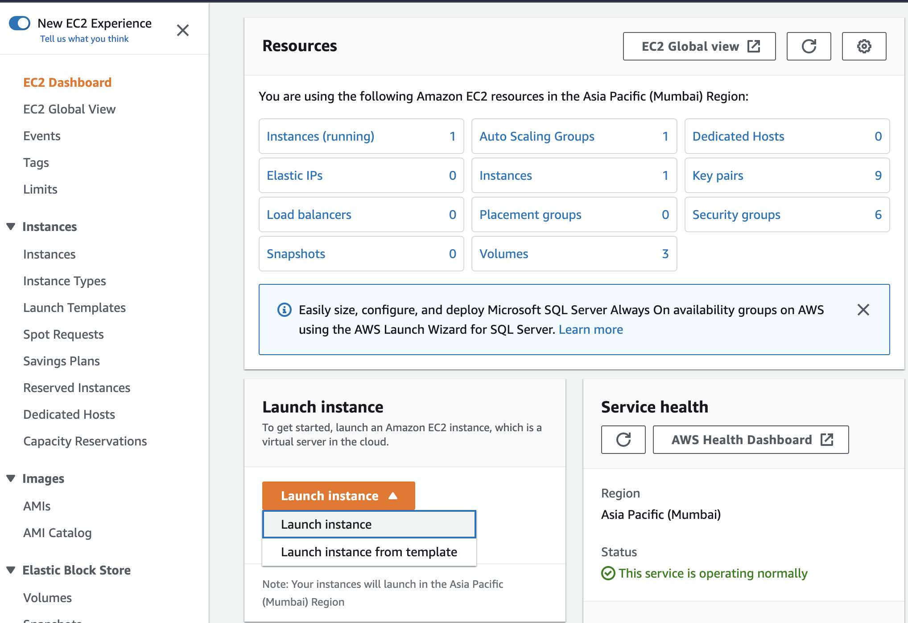
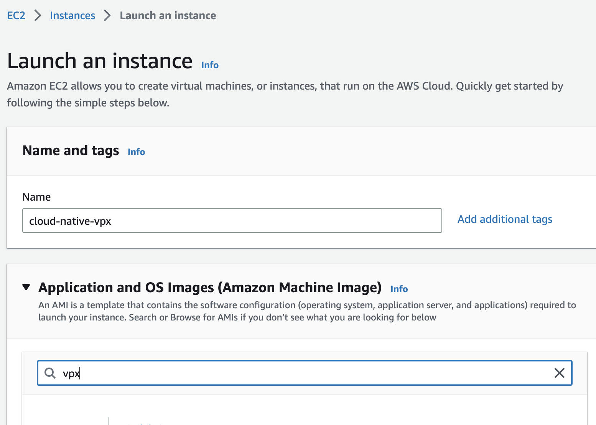
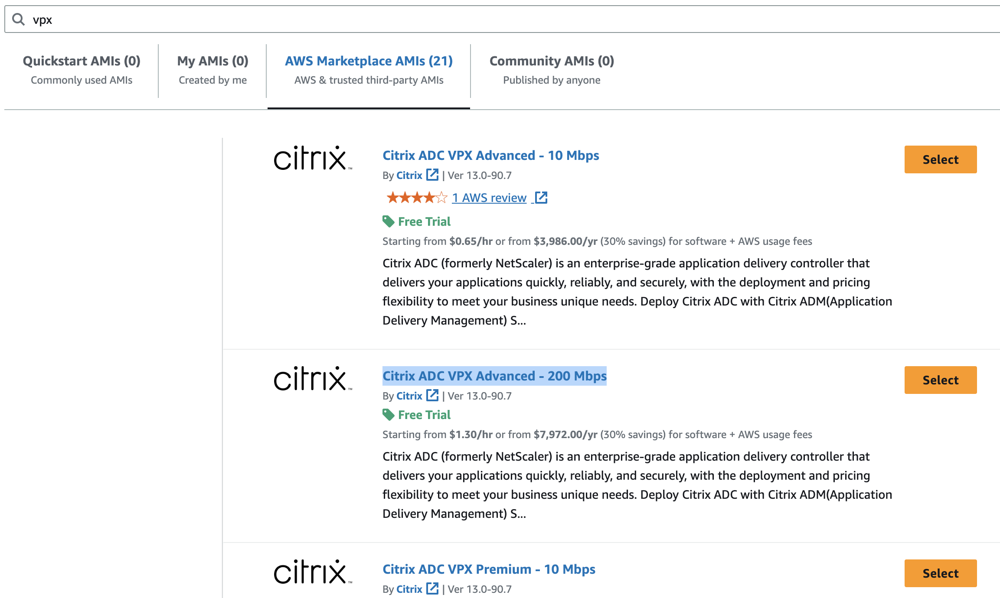
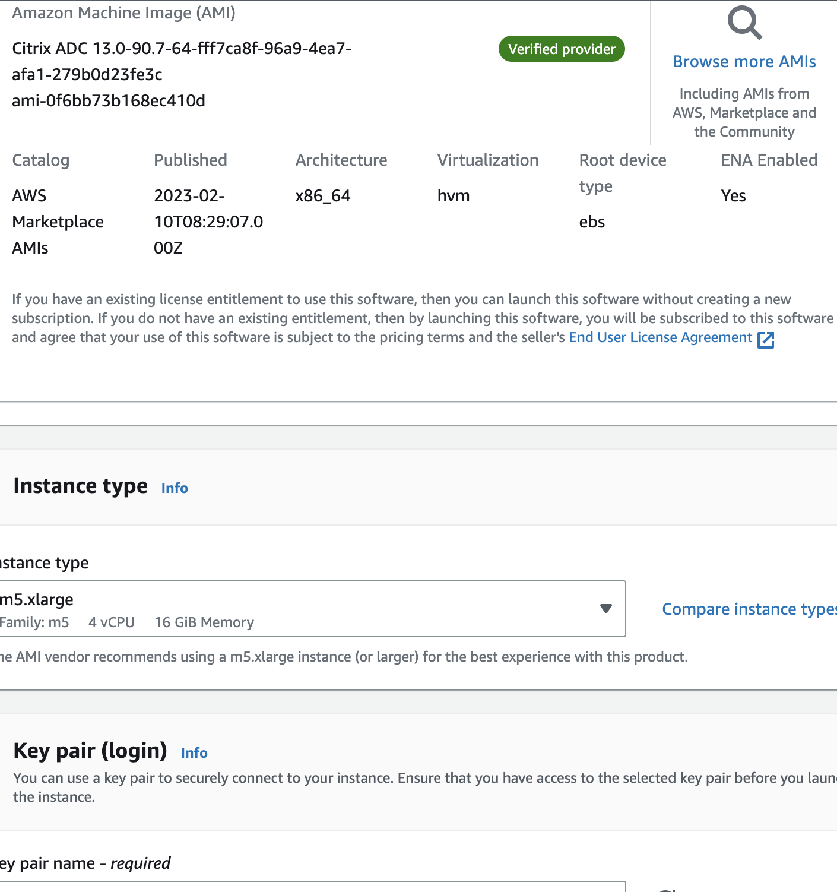
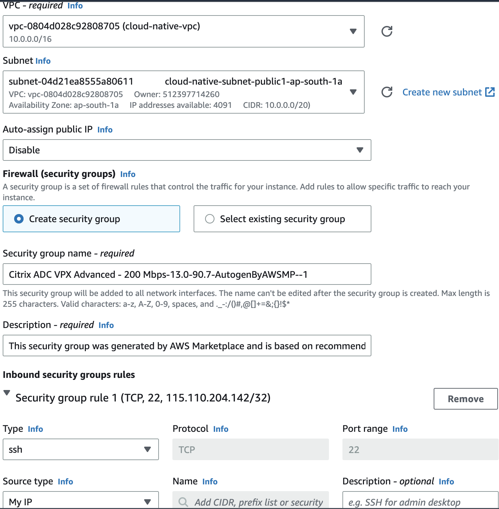
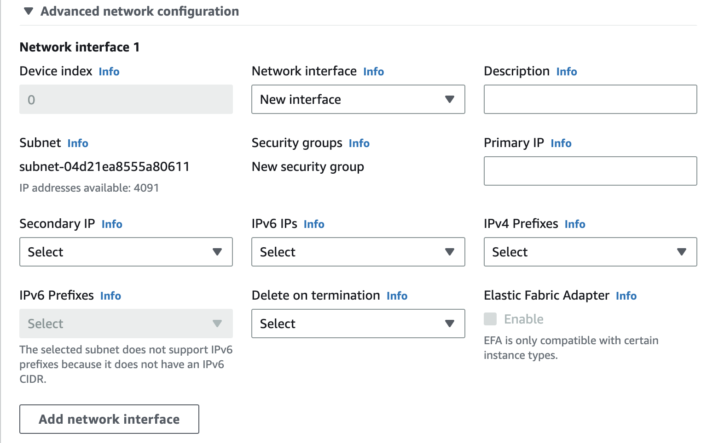
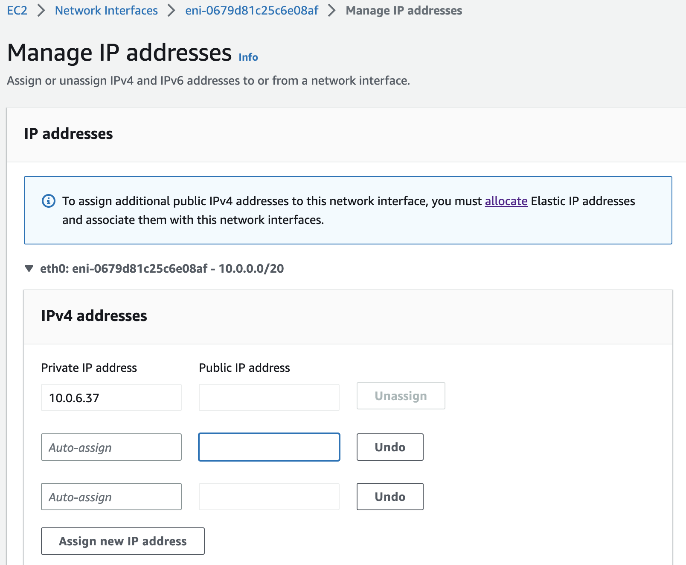
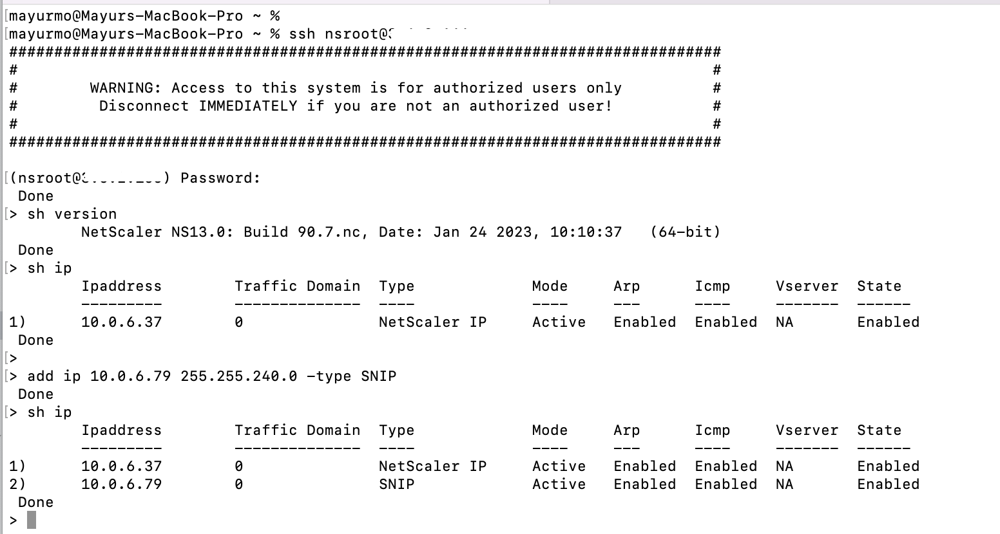

# Set up a NetScaler VPX on AWS 

You can instantiate NetScaler VPX instance on AWS in multiple ways however we will use AWS marketplace offer to set up a VPX on AWS

#### Create NetScaler VPX instance on AWS

1. Prerequisite

	Note: For cloud-native demos, we will deploy VPX and EKS cluster in same VPC. In case you want to have VPX and EKS cluster in different VPC, then you should have VPC peering to ensure VPX and EKS can communicate each other.

	Since EKS cluster in deployed in ap-south-1 (Mumbai) region, VPX will be deployed in Mumbai region.

	Click on Regions -> Mumbai for deploying VPX

	Goto EC2 dashboard: Select EC2 services from search option

2. Deploy VPX from AWS marketplace

	Click on Launch Instance -> Launch Instance from EC2 dashboard

	

	Follow the instuctions on launch instance page to deploy VPX from marketplace,

	Name of instance: cloud-native-vpx
	Search VPX in applications and OS images to find VPX SKU from marketplace

	

	Search for Citrix ADC VPX Advanced - 200 Mbps SKU from AWS marketplace AMI and click on Select. You can also select any other VPX SKU from marketplace as per your requirement.

	

	Click on Continue and proceed (Continue option is present at bottom of page, in case not able to navigate to bottom of page using Tab key).

	You will be back to launch instance page where fill out rest of information:

	Instance type: It will be auto populated for SKU selected from marketplace
	Key pair (login): Provide key pair to be used for loging into VPX

	

	Networking settings: Click on Edit button and change the VPC to cloud-native-vpc (VPC created for EKS) 
	Subnet: Select one of public subnet used while creating EKS cluster
	Auto-assign public IP: Disable (we will manage IPs after creating compute)
	Inbound security groups rules -> Enable inbound rules for ssh, tcp, http and https for Souce Type: My IP

	

	Expand Advanced network configuration section:
	Network interface 1 : Create new interface
	(We will create single NIC VPX deployment, which will have 3 IPs used as NSIP, VIP and SNIP)

	

	Use default values for section Configure storage and Advanced details.

	Click on Launch instance, in few minutes your VPX will be instantiated.
	

3. 	Create EIPs

	Click on Elastic IPs from EC2 dashboard resources to create 2 EIPs.
	

	Click on Allocate Elastic IP address, create tag name: cloud-native-nsip and click on allocate. Edit the name of EIP to cloud-native-nsip

	Click again on Allocate Elastic IP address, create tag name: cloud-native-vip and click on allocate. Edit the name of EIP to cloud-native-vip

	You will see that 2 EIPs has been allocated to you.
	

4.	Configure VPX (IP allocation)

	Goto to EC2 -> Instances -> Cloud-Native-vpx instance ID -> Networking -> Network interfaces -> Click on interface ID

	Select the Interface ID checkbox and goto Actions -> Manage IP addresses

	Assign 2 new IP addresses to given interface

	

	Select the Interface ID checkbox of VPX and goto Actions -> Associate address

	Associate the one EIP (cloud-native-nsip) to private primary IP (this IP is present in network interface section of VPX instance summary)

	Associate the another EIP (cloud-native-vip) to another IP

3. VPX instance is ready

	Note the EIP assocaited as NSIP and login to VPX using terminal/CLI, your password is instance id which has to be changed during first login.

	Add SNIP details to VPX to begin with NetScaler deployments.
	```
	add ip <private ip not associated with any EIP> 255.255.240.0 -type snip
	```
	Note: VPX subnet is /20 hence subnetmask 255.255.240.0 is added to SNIP, please check your VPX subnet and make changes to subnetmask accordingly.

	


