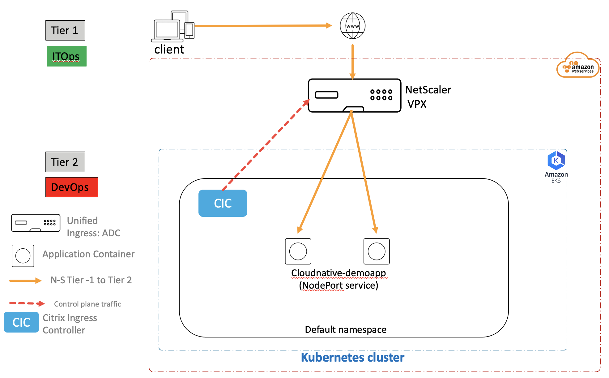
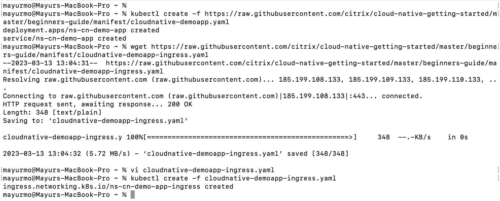

# Load balance microserviced based applications using NetScaler VPX (Tier 1 ADC as NetScaler VPX, Tier 2 as microservice applications in EKS)

In this guide you will learn:

* How to deploy a microservice application exposed as NodePort type service.
* How to configure NetScaler VPX (Tier 1 ADC) using Citrix Ingress Controller to load balance applications.

NetScaler supports Unified Ingress architecture to load balance an enterprise grade applications deployed as microservices in AWS kubernetes service - EKS. NetScaler VPX acts as high scale, secure North-South proxy. Lets understand the Unified Ingress topology using below diagram.



##### Deployment steps:

1. Pre-requisite

	* Ensure that you have VPX and EKS running on AWS.
	* To bring EKS follow [EKS guide](https://github.com/citrix/cloud-native-getting-started/blob/master/aws/eks/README.md)
	* To bring VPX follow [VPX guide](https://github.com/citrix/cloud-native-getting-started/blob/master/aws/aws-vpx/README.md)
	* Install [kubectl](https://kubernetes.io/docs/tasks/tools/#kubectl) and [AWS CLI](https://docs.aws.amazon.com/cli/latest/userguide/getting-started-install.html) on your machine to access EKS locally.
	* Create Security policies (inbound rules) for VPX and EKS to enable the traffic flow (Add EKS security group details in VPX inbound security rules and vice versa)
	

	Access EKS cluster from AWS CLI
	```
	aws eks --region ap-south-1 update-kubeconfig --name cloud-native-eks
	```
	


2. Deploy Citrix Ingress controller using HELM

	* Lets add the citrix helm repo
	```
	helm repo add citrix https://citrix.github.io/citrix-helm-charts/
	```
	> **Note:** In case you do not have HELM installed on your machine, please install HELM from https://helm.sh/docs/intro/install/ 

	
	* Create VPX login secret
	```
	kubectl create secret generic nsvpxlogin --from-literal=username='nsroot' --from-literal=password='mypassword'
	```
	> **Note:** Update username and password which is used while instantiating the VPX.

	* Install CIC

	Copy below snipped into values.yaml file
	```
	cic:
     enabled: True
     nsIP: x.x.x.x
     adcCredentialSecret: nsvpxlogin
     license:
       accept: yes
     ingressClass: ["vpx"]
     ignoreNodeExternalIP: True
	```
	nsIP = Use primary private IP associated to VPX NIC (Goto to EC2 -> Instances -> Cloud-Native-vpx instance ID -> Check for Private IPv4 addresses in instance summary)

	```
	helm install cic citrix/citrix-cloud-native -f values.yaml
	```

	* Install SSL certificate on VPX using K8s secret.
	```
	kubectl create -f cloudnative-secret.yaml
	```
	> **Note:** Due to security reasons secret file is not present on GitHub repo, you can create your own secret or contact NetScaler cloud native team for dummy secret file.

	

3. Deploy sample application exposed as NodePort

	```
	kubectl create -f https://raw.githubusercontent.com/citrix/cloud-native-getting-started/master/beginners-guide/manifest/cloudnative-demoapp.yaml
	```
        > **Note:** In case the application service is of type NodePort, Citrix Ingress Controller will only add the IP of Node(s) having application pods as a backend server in NetScaler.

4. Expose application using Ingress

	```
	wget https://raw.githubusercontent.com/citrix/cloud-native-getting-started/master/beginners-guide/manifest/cloudnative-demoapp-ingress.yaml
	```

	Update ingress.citrix.com/frontend-ip: "x.x.x.x" with private IP associated with VIP EIP.

	```
	kubectl create -f cloudnative-demoapp-ingress.yaml
	```
	

5. Deployment successful

	Try accessing your application now
	```
	curl -H "Host: cloudnative.netscalerdemo.com" https://EIP for VIP -kv
	```

